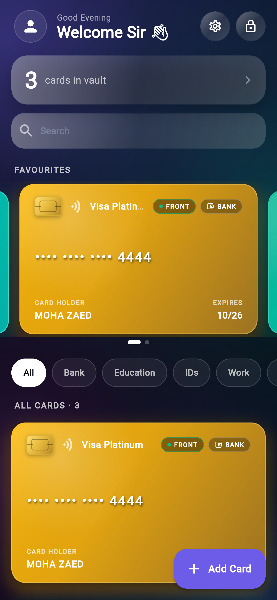

  

# Moha Card Holder

An offline-first, encrypted wallet for your physical cards — bank cards, IDs, student and work badges, memberships — for Android.

Scan a card with the camera and it is cropped, cleaned up and stored with its details, all encrypted on your phone.

  

  <a href="https://github.com/7Mohan/moha-card-holder-app/releases/latest"><b>Download the latest APK</b></a>

## Features

- **Encrypted vault** — card numbers and PINs are encrypted with AES-256; keys live in the Android Keystore. Nothing is uploaded.
- **Unlock with PIN or fingerprint**, auto-lock when you leave the app, and optional screenshot blocking.
- **Card scanner** — finds the card in the photo, crops it, removes the background, enhances it and reads the number, name and expiry on the phone.
- **3D cards** — drag any card to spin it 360°, tap to flip; smooth up to 144 Hz.
- **Document scanner** — multi-page capture with edge detection, a *Clean* filter that removes shadows, text recognition, and export to PDF or Word.
- **Share by NFC** — tap two phones together to send a card (never the CVV/PIN or photos).
- Expiry reminders, home-screen widget, QR/barcode for each card, profile photo and name, and a guided tour on first launch.

## Install

1. Download the APK from the [latest release](https://github.com/7Mohan/moha-card-holder-app/releases/latest) on your Android phone (Android 6.0 or newer).
2. Open it and allow installing from this source if asked.

This is a test build signed with a debug key, so Play Protect may show a warning — tap **Install anyway**.

## Privacy

Your cards are stored only on your phone and are deleted if you uninstall the app. NFC sharing sends the card name, holder, number, expiry and colours only to the phone you tap.

## Feedback

Found a bug or have an idea? [Open an issue](https://github.com/7Mohan/moha-card-holder-app/issues).

## License

Copyright © 2026 Mohamed Bashir. All rights reserved. The source code is not public. See [LICENSE](LICENSE).
